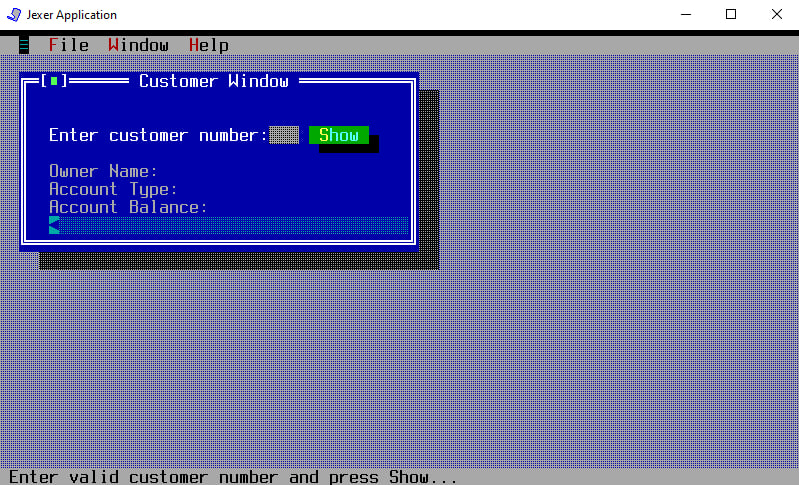
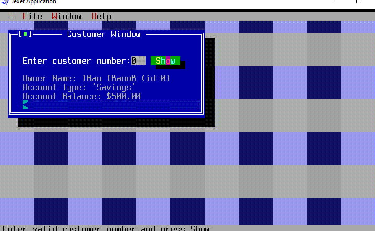
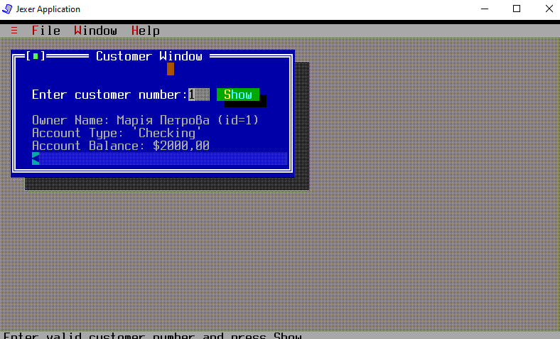

# UI Lab 1

# Звіт про виконання практичної роботи
## Тема: Побудова текстового користувацького інтерфейсу (TUI) за допомогою бібліотеки Jexer

---

### 1. Мета роботи
Навчитися інтегрувати сторонні Java-бібліотеки (`.jar`) у проєкт розробки, опанувати принципи побудови текстового користувацького інтерфейсу (TUI) та забезпечити динамічну взаємодію графічних елементів із бізнес-логікою (класами `Bank`, `Customer`, `Account`), розробленою в попередніх лабораторних роботах.

---

### 2. Завдання роботи
1. Налаштувати Java-проєкт у середовищі розробки без використання автоматичних інструментів збирання (No build tools).
2. Підключити зовнішні залежності: бібліотеку TUI-інтерфейсу `jexer.jar` та компільовану бібліотеку з класами предметної області `MyBank.jar`.
3. Організувати структуру пакетів відповідно до директиви `package com.mybank.tui;`.
4. Модифікувати метод `ShowCustomerDetails()` для забезпечення динамічного пошуку та відображення даних клієнтів за їхнім ідентифікатором (ID).

### 2. Скріншоти роботи

